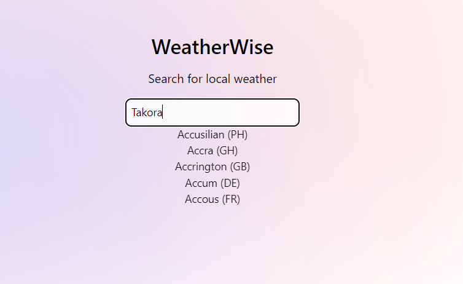
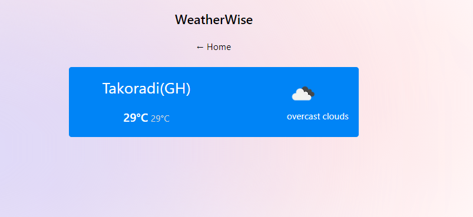

## WeatherWise (Built with React, Nextjs 13, and Styled with TailwindCSS  )



## About WeatherWise 

Weatherwise is a dynamic web application that gives a seamless experience in real time. 
You can search for the current weather information on any major city across the world!
Check out the live project here : 

## Getting Started

- First, clone the project:

```bash
git clone weatherwise https://github.com/philipObiri/WeatherWise.git
```

- Please make sure you switch to the directory that has just been created (If haven't):

```bash
cd WeatherWise
```

- Install the needed packages:
```bash
npm install
```


- Create an environment file by changing the name of the .env_example file in the project directory to .env

- Sign up with Open Weather and get a SECRET API KEY.
  
- Run the development server.

```bash
npm run dev
# or
yarn dev
# or
pnpm dev
# or
bun dev
```

Open [http://localhost:3000](http://localhost:3000) with your browser to see the result.

You can start editing the page by modifying `pages/index.tsx`. The page auto-updates as you edit the file.

[API routes](https://nextjs.org/docs/api-routes/introduction) can be accessed on [http://localhost:3000/api/hello](http://localhost:3000/api/hello). This endpoint can be edited in `pages/api/hello.ts`.

The `pages/api` directory is mapped to `/api/*`. Files in this directory are treated as [API routes](https://nextjs.org/docs/api-routes/introduction) instead of React pages.

This project uses [`next/font`](https://nextjs.org/docs/basic-features/font-optimization) to automatically optimize and load Inter, a custom Google Font.


